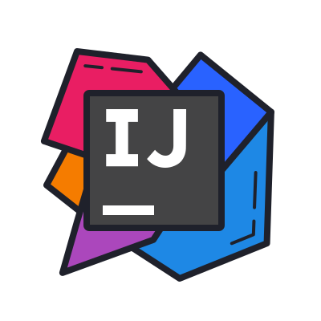

<h1 align="left" id="macropower-title">:wave: 안녕하세요 저는 나무오리(Kim Yu Seok) 입니다</h1>
<h3 align="left">소소한 개발자 입니다</h3>

```python
print('Hello, World');
```


<p align="left">
  <a href="https://github.com/NAMUORI00/">
    
  </a>
  <a href="https://namuori00.github.io">
    
  </a>
  <a href="https://github.com/NAMUORI00?tab=followers">
    
  </a>
</p>

<a href="#macropower-title">
  
</a>

- :office: 현재 새로운터를 찾는중입니다
- :seedling: 자라나는 새싹이에요
- :speech_balloon: 개발에 관련한 대화라면 뭐든 흥미롭게 듣습니다
- :book: 디지털가든을 이용해 정리하고자 합니다
- :mailbox: 이슈를 통해 언제든지 의견 나누어주세요

<br>

<h2 align="left" id="macropower-tech">사용 경험이 있는 기술</h2>

> 한번이상은 사용하고 코드를 작성한적이 있는 경험이 있으면 리스트에 넣었습니다.
>
> 완벽하게 잘하지는 않으며 사용하게 될경우 '조금' 더 친근하게 다가갈 수 있을거 같습니다.
>
> 그 외에도 다양한 기술을 사용해보고 접했지만 생략하겠습니다
>

<br>

<h2 align="left" id="macropower-tech">현재 진행형</h2>

> 진로에 대한 고민에 빠져들었습니다.
>
> 지식 정리 배포에 관심을 가지고 있습니다.
>
> 취미로 플레이하는 게임의 Asset 추출, 복구에 관심을 가지고 있습니다.
>
> Ulfrisk의 Pcileech를 이용한 PCie DMA 취약점에 관심이 있어 관련 프로젝트를 포크, 빌드해보고 있습니다.(엔지니어리버싱)

<br>

<h2 align="left" id="macropower-tech">근래 관심을 가지는 주제</h2>

> Novel AI, RVC 등의 생성형 이미지 AI, 보이스 클로닝에 관심을 가지고 있습니다
>
> CivitiAI에서 안내중인 Lora, Lycoris 커스텀 이미지 모델 학습에 관심이 있습니다
>
> 허깅페이스에서 제공하는 이미지 배경제거, 수치 예측 프로젝트를 참고하여 간단한 토이프로젝트를 고민하고 있습니다.
>
> 로컬 LLM에 관심이 있습니다. (우바부가, LLM WebUI 위주) GPT-4o에 사용자지정 프롬프트에 관심이 있습니다.

<table>
  <tr>
    <td align="center" width="96">
      <a href="#macropower-tech">
        
      </a>
      <br>JS
    </td>
    <td align="center" width="96">
      <a href="#macropower-tech">
        
      </a>
      <br>Python
    </td>
    <td align="center" width="96">
      <a href="#macropower-tech">
        
      </a>
      <br>Mysql
    </td>
    <td align="center" width="96">
      <a href="#macropower-tech">
        
      </a>
      <br>Bootstrap
    </td>
    <td align="center" width="96">
      <a href="#macropower-tech" >
        
      </a>
      <br>JAVA
    </td>
    <td align="center" width="96"> 
      <a href="#macropower-tech" >
        
      </a>
      <br>Docker
    </td>
    <td align="center"  width="96">
      <a href="#macropower-tech">
        
      </a>
      <br>csharp
    </td>
    <td align="center" width="96">
      <a href="#macropower-tech" >
        
      </a>
      <br>intellij-idea
    </td>
  </tr>
</table>

<h2 align="left">만들어온 사이드 프로젝트</h2>

<h2>📘 </h2>

<p align="left">
    <a href="https://github.com/NAMUORI00/OSC-SRTC"></a>
    <a href="https://github.com/NAMUORI00/CRUD"></a>
    <a href="https://github.com/NAMUORI00/jsquiz-app"></a>
    <a href="https://github.com/NAMUORI00/music_splitter_project"></a>
    <a href="https://github.com/NAMUORI00/Osaka_mobile_FoodScan"></a>
    <a href="https://github.com/NAMUORI00/good-price-jeju"></a>
    <a href="https://github.com/NAMUORI00/Golden_Glove"></a>

