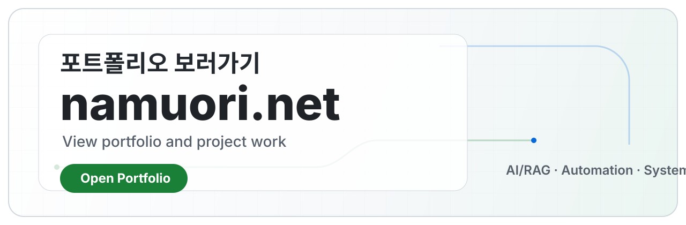

<!-- Header -->

 

### 공개·비공개 프로젝트 전반에서 웹 서비스, 시스템 개발, 인프라 자동화, AI/RAG·경량 추론까지 폭넓게 다뤄 온 개발자입니다.

 

<a href="https://namuori.net">
  <picture>
    <source media="(prefers-color-scheme: dark)" srcset="./img/portfolio-card-dark.svg" />
    <source media="(prefers-color-scheme: light)" srcset="./img/portfolio-card-light.svg" />
    
  </picture>
</a>

 

## GitHub Activity

  
  
  

 

  

 

  

 

## Tech Stack

**Experience Stack**

공개·비공개 프로젝트에서 직접 구현하며 다뤄 온 기술

  

 

 

 

  

**Interest Stack**

2026년 기준 스타·리서치 흐름에서 계속 추적 중인 기술

  

 

 

 

### Open Collaboration

&nbsp;

  

