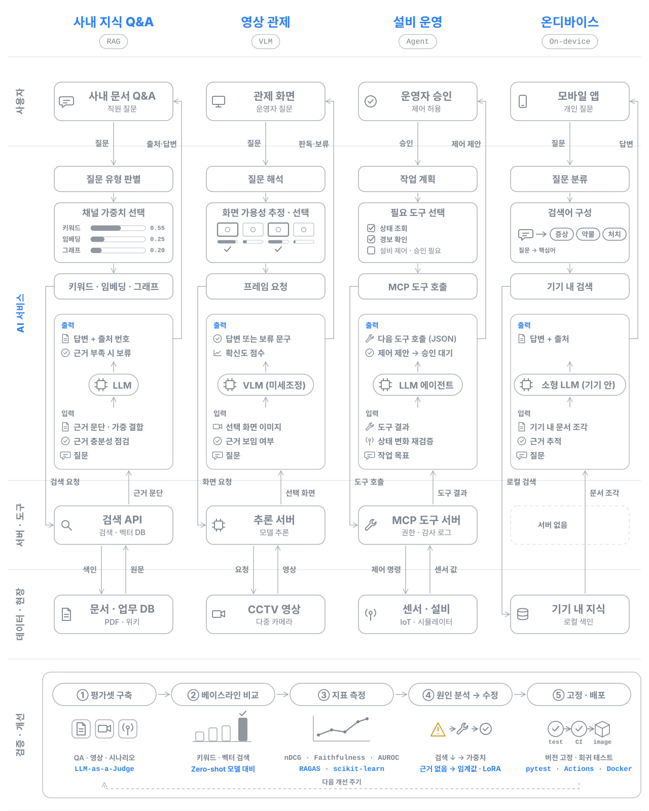

## 김유석 (KIM YUSEOK)

### 신입 AI 엔지니어 — LLM, RAG, VLM, AI 에이전트

연구로 검증한 AI 기능을 실제로 쓸 수 있는 서비스까지 연결합니다.

<a href="https://namuori.net">포트폴리오 namuori.net</a> &nbsp;|&nbsp; <a href="https://namuori00.github.io/smartfarm-adaptive-rag/">스마트팜 대시보드 데모</a> &nbsp;|&nbsp; <a href="mailto:namuori00@namuori.net">namuori00@namuori.net</a>

 

## 대표 프로젝트

| 프로젝트 | 내용 | 핵심 결과 |
|---|---|---|
| [**smartfarm-adaptive-rag**](https://github.com/NAMUORI00/smartfarm-adaptive-rag) | 스마트팜 AI 운영 지원 시스템. 질의 적응형 검색(QACT), 승인형 설비 제어(MCP), 3D 운영 대시보드 | nDCG@10 +0.023~0.087, KCI 등재지 제1저자 게재, [라이브 데모](https://namuori00.github.io/smartfarm-adaptive-rag/) |
| [**multiview-selective-vqa**](https://github.com/NAMUORI00/multiview-selective-vqa) | 근거가 충분할 때만 답하는 다중 시점 CCTV 질의응답 (Qwen3-VL-8B, LoRA) | 잘못된 답 공개 27 → 0건, 정답 공개 +41.2%p, IEEE Access 제1저자 심사 중 |
| [**smartfarm-state-revalidation**](https://github.com/NAMUORI00/smartfarm-state-revalidation) | 센서가 바뀐 부분만 다시 쓰는 선택적 답변 수정 (석사학위논문 연구) | 전체 재생성과 같은 응답–상태 일치를 유지하며 다시 생성하는 단위 26.5% 감소 |
| [**ondevice-medical-rag**](https://github.com/NAMUORI00/ondevice-medical-rag) | 인터넷 없이 Android에서 동작하는 근거 추적형 의료 질의응답 (Gemma 4 E2B) | 학회 발표 제1저자, 근거 검색 평균 4.5ms |

그 밖의 프로젝트: [aerospace-rag](https://github.com/NAMUORI00/aerospace-rag) (Colab 3채널 문서 RAG), [comfyui-docker-installer](https://github.com/NAMUORI00/comfyui-docker-installer) (GPU 서버 ComfyUI 설치 패키지), [music-splitter-web](https://github.com/NAMUORI00/music-splitter-web) (AI 음원 분리 웹 서비스)

 

## 기술 스택

<table>
<tr><td><b>AI 모델</b></td><td><code>PyTorch</code> <code>Hugging Face Transformers</code> <code>PEFT (LoRA)</code> <code>vLLM</code> <code>Qwen3-VL</code> <code>Gemma</code> <code>MCP</code></td></tr>
<tr><td><b>검색과 RAG</b></td><td><code>Qdrant</code> <code>FalkorDB</code> <code>BM25</code> <code>Hybrid Search (RRF)</code> <code>RAGAS</code></td></tr>
<tr><td><b>백엔드</b></td><td><code>Python</code> <code>FastAPI</code> <code>Pydantic</code> <code>Java</code> <code>Spring Boot</code> <code>MySQL</code> <code>pytest</code></td></tr>
<tr><td><b>인프라</b></td><td><code>Docker</code> <code>GitHub Actions</code> <code>Linux</code> <code>GPU 서버 운영</code></td></tr>
<tr><td><b>프론트엔드</b></td><td><code>React</code> <code>TypeScript</code> <code>Three.js</code></td></tr>
<tr><td><b>개발 도구</b></td><td><code>Claude Code</code> <code>Codex</code> <code>MCP 서버 개발</code></td></tr>
</table>

 

## 연구 실적

- 김유석, 김용운, 변영철, 「스마트팜 RAG를 위한 질의 적응형 검색 채널 제어」, *한국정보기술학회논문지*, 2026 (KCI 등재지, 제1저자)
- Role-Separated Selective Response for Question Answering in Multi-View Video Surveillance, *IEEE Access* (제1저자, 심사 중)
- 근거 추적형 로컬 RAG 기반 온디바이스 의료 질의응답 시스템, 한국정보기술학회 하계종합학술대회 2026 (제1저자 발표)
